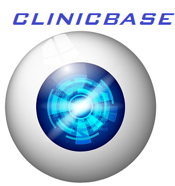

# CLINICBASE

<div align="center"> </div>


## Table of Contents

- [Overview](#overview)
- [Features](#features)
- [Getting Started](#getting-started)
- [Installation](#installation)
- [Usage](#usage)
- [Our Story](#our-story)
- [License](#license)
- [Contact](#contact)


## Overview

**ClinicBase** is a robust web application designed to optimize clinical workflows and improve patient care within eye clinics in Ghana. This comprehensive solution tackles the specific challenges faced by eye clinics by centralizing data management, automating workflows, enhancing data security, and providing efficient patient medical record management.


## Features

- **Centralized Data Management:** Consolidate patient records, diagnostic data, and other related data in a secure and efficient database, eliminating data silos and redundancy.

- **Workflow Optimization:** Automate patient registration, consultation  scheduling, diagnostic tests, and treatment planning, resulting in improved patient throughput and reduced administrative workload.

- **Data Security and Privacy:** Implement robust security measures to protect patient data and ensure compliance with healthcare data protection regulations in Ghana.

- **Data Analytics:** Enable data analytics and reporting, providing valuable insights for healthcare administrators to make informed decisions and allocate resources effectively.

- **Efficient Patient Medical Record Management:** Streamline the handling of patient medical records, ensuring data accuracy and completeness while reducing administrative burden.

- **User-Friendly Interface:** The application features an intuitive, user-friendly interface that ensures easy access and navigation for healthcare staff.


## Getting Started

To get started with the Eye Clinic Database Management System, follow these steps:

### Prerequisites

- Nodejs -version > 14.x
- MongoDB


## Installation

1. **Clone the Repository:**

    ```sh
    git clone https://github.com/michaelmensa/Alx-final_project.git
    ```

2. **Install Dependencies:**

    ```sh
    cd Alx-final_project
    npm install 
    ```

3. **Run the Application:**

    ```sh
    npm run start-server
    ```

## Usage

Efficient utilization of the application within the clinical setup involves leveraging specific dashboards tailored for different roles within the clinic. From user management to patient care coordination, each dashboard offers unique functionalities contributing to streamlined operations and enhanced patient care.


### Functionalities of the Administrative Dashboard

Upon acquisition of the application by the clinical setup and the issuance of secured login credentials by the developers, the administrative dashboard offers a range of essential functionalities:

#### User Management:
Authorized clinic personnel, herein referred to as administrator, can create, update, and delete user accounts for receptionists and optometrists. This feature ensures streamlined management of personnel involved in the clinic's day-to-day operations.

#### Patient Medical Records Access:
The dashboard grants access to securely retrieve and manage patient medical records, ensuring efficient access to vital healthcare information. This feature significantly contributes to organized patient care within the clinic.

#### Basic Analytics:
The administrator can generate essential analytics related to patients and cases within specified periods. This tool aids in informed decision-making, resource allocation, and strategic planning, enhancing operational efficiency and patient care.

#### Search Functionalities:
Robust search capabilities are available to enable the quick location of both patients and employees, facilitating swift and precise retrieval of pertinent information. This feature streamlines workflows and contributes to an organized operational structure within the clinic.

### Employee Dashboard Functionalities

Once the administrator creates an employee account, login credentials provide access to the employee dashboard, offering the following functionalities:

#### Patient Management:
- **Creation of New Patients:** Employees can create new patient profiles, ensuring an updated database of clinic attendees.
- **Patient Information Update and Deletion:** Employees can modify patient details and manage records as needed, maintaining accurate and updated patient information.
- **Scheduling Patients to Optometrists:** Employees can schedule patients' appointments with optometrists, facilitating efficient time management and patient care.
- **Access to Medical Prescriptions:** Employees can access and retrieve medical prescriptions for patients, ensuring seamless coordination of care.
- **Patient Search Functionality:** The dashboard features robust search functionalities, enabling employees to quickly locate patient records as needed for efficient clinic operations.

### Optometrist Dashboard Functionalities

The optometrist dashboard, designed for seamless workflow coordination with the receptionist dashboard, offers the following functionalities:

#### Patient Queue Management:
- **Coordinated Scheduling:** Patient appointments scheduled by receptionists appear in the patient queue on the optometrist dashboard, enabling smooth patient transitions and timely consultations.

#### Case Management:
- **Patient Case Creation:** Optometrists create patient cases from which medical records are generated and stored for ongoing patient care.
- **Uncompleted Case Retrieval:** The dashboard allows optometrists to access uncompleted cases within a specific day, ensuring continuity in patient care.
- **Save Uncompleted Cases:** Optometrists can save ongoing cases before submission upon completion, facilitating incremental progress and accuracy.
- **Submission of Completed Cases:** Completed cases are submitted from the dashboard, and patient prescriptions are sent to the receptionist dashboard for further management.

#### Medical Records Access:
- **Access to Previous Medical Records:** Optometrists can access previous medical records of patients, enabling informed and comprehensive patient care.


## Our Story

### Student-Led Innovation in Eye Healthcare

In the heart of Ghana, our passionate team of four students embarked on an ambitious mission to redefine eye healthcare. Armed with our collective knowledge of software engineering and web application development, we set out to revolutionize clinical management.

Through our combined expertise, we crafted a sophisticated Node/Express-based web application, leveraging RESTful APIs and JavaScript engines. Our understanding of software engineering intricacies allowed us to orchestrate flawless communication between components, ensuring seamless integration.

The application we developed wasn't just a tech project; it was a manifestation of our dedication to merging technology with healthcare intricacies. By transforming complex clinical workflows into an intuitive interface, we aimed to empower healthcare providers for efficient patient care.

Our journey symbolizes the potential of technology in healthcare, especially when guided by passionate students. As we continue this journey, our story stands as an inspiration to those shaping the future of healthcare through innovative technology.


## Authors

- `Michael Mensah:` [GitHub](https://github.com/michaelmensa)
- `Daniel Frempong:` [GitHub](https://github.com/Gig2341)
- `David Tikoli:` [GitHub](https://github.com/Dtikoli)
- `William Dickson:` [GitHub](https://github.com/williamsHack)


## License

This project is licensed under the MIT License.


## Contact

If you have any questions, feedback, or need further information, please contact Michael Mensah.


**Note**: This project is currently limited to eye clinics. Future developments may extend the application functionality to include other clinical setups.


